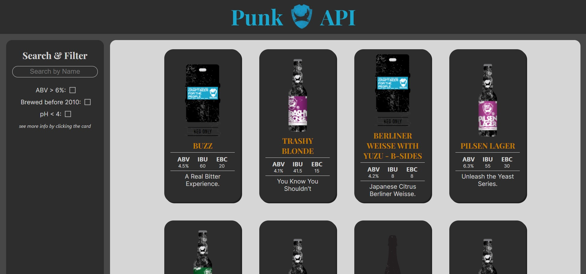

# Punk API

  

### Author - Reuben George
A react app that utilises a brewdog api to populate the page with info about each product sold. Each product can be filtered by search or by using the filters individually or together.

### Technologies used
SCSS, JavaScript, React, JSX